# Hosting multiple static websites on a single server
This repository acts as a guide to host multiple websites on a single server using AWS (Amazon Web Services).


<h2> Attribution </h2>
Hello everyone, you are welcome to make use of this guide and learn from it but please do not copy without giving attribution to the author.

<h2> Let's Start the Guide </h2>

First of all we will learn how to launch a virtual server on AWS on which we will be hosting our static websites. It takes only a few clicks to launch a new virtual server.
1. Open the AWS Management Console at https://console.aws.amazon.com.

2. Choose the region in which you want to launch your virtual server and make sure you choose the region nearer to users to        reduce latency.

3. Find the EC2 service in the navigation bar under Services and click it. It will open the EC2 Management Console.

4. To start the wizard for launching a virtual server, start by clicking on Launch Instance button.

This is how your EC2 Management looks like.


After clicking on the Launch Instance button you will be redirected for selecting the operating system for your virtual machine. The first step is to choose a bundle of an OS and preinstalled software for your virtual server called an Amazon Machine Image(AMI). Here I will be working on Amazon Linux AMI 2018.03.0(HVM).


After selecting the AMI it's time to choose the size of your virtual server by choosing the Instance Type. The smallest and cheapest virtual server will be enough so select the instance type t2.micro which is also free tier eligible and then click Next:Configure Instance Details.


In the next step where you want to configure Instance Details, choose the VPC and the subnet in which you want to provision the instance(virtual server). Make sure you select public subnet and must also remember the availability zone of that subnet.
Also under <b>Auto-assign Public IP </b> choose <b>Enable</b> so that a public IP is provided.
You can also change other details for your virtual server but for now keep the defaults and click Next:Add Storage.


In the next step, there will be option to add storage to your virtual server. Leave the root storage as default and click Next:Tag Instance.


Another step is to provide tags to your virtual server. Tags help you to organize resources on AWS. A tag is nothing but a key-value pair. It is an optional step so skip it by clicking Next:Configure Security Group.


The next step is to configure the security group i.e. a firewall that helps to secure your virtual server. There are two options in this step. Either you can create a new security group or select an existing security group. If you do not have a security group click on create a new security group and make a new one by adding rules just as shown in below screenshot. After configuring the security group, click Review and Launch.


In the next step, the wizard shows a review of all the configurations you have made to your new virtual server. If everything seems fine, click the Launch button.


Last but not the least, the wizard asks for Select an existing key pair or create a new key pair. It depends on you. If you already have a key pair and it is with you then choose existing key pair, otherwise create a new key pair and download it.
After downloading click Launch Instances.


Your virtual server launches. Open an overview by clicking View Instances and wait until the server reaches to its running state and also make sure that it passes both status checks i.e. 2/2 checks.


This ends the guide for launching a new virtual server in the cloud.

Now, before doing SSH login to our newly created virtual server lets do some more configuration in the instance to allow it to host multiple websites.

Follow the steps to configure the instance.
<h2> 1. Allocating the elastic IP address and associating it to the instance </h2>

You have already launched a virtual server above. The virtual server was connected to a public IP address automatically. But every time you stop and start the virtual server, the public IP address would change. If you want to host any website under a fixed IP address, this won't work. That's why AWS offers Elastic IP address for allocating fixed public IP address.
You can allocate and associate a fixed public IP address to a virtual server with the following steps:

<h5> Allocating the Elastic IP Address </h5> 

a) Open the EC2 Management Console.

b) Choose the Elastic IP from the submenu.

c) Allocate a public IP address by clicking Allocate New Address.

This is the Elastic IP address wizard. Click on Allocate New Address and then click Amazon Pool.You will see after choosing Amazon Pool, Elastic IP will be allocated. The whole process of allocating IP is shown in below screenshots.

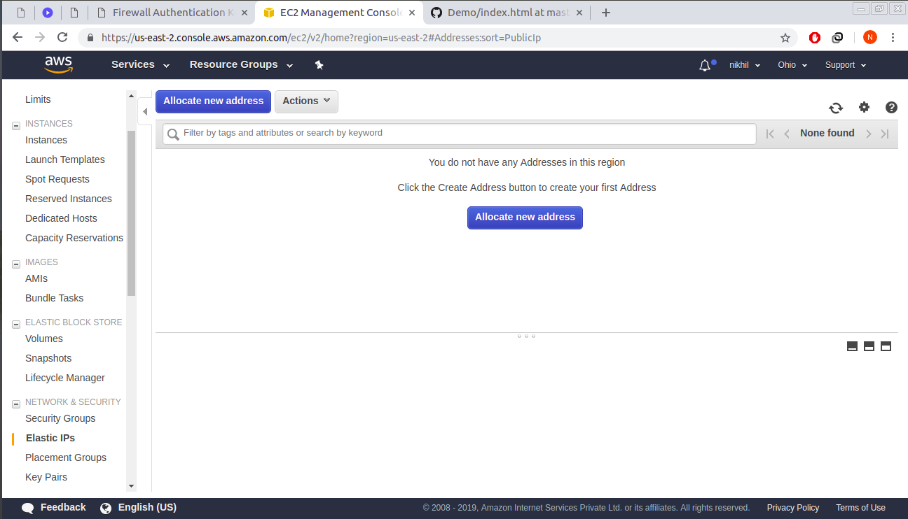

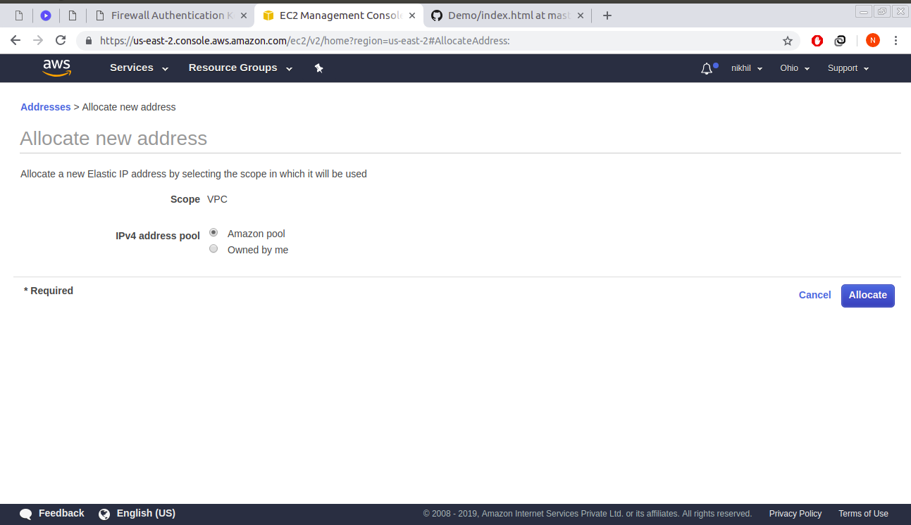

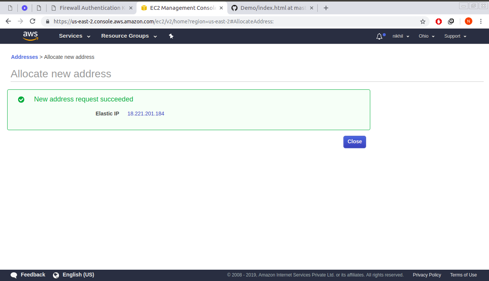

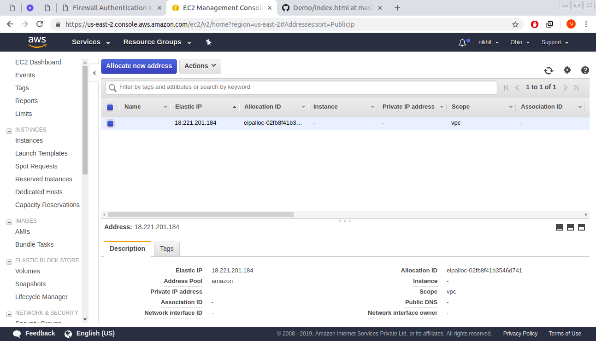


<h5> Associating the Elastic IP address to the instance </h5>

a) Select the public IP address in the Elastic IP address wizard and choose Associate address from the Actions menu.

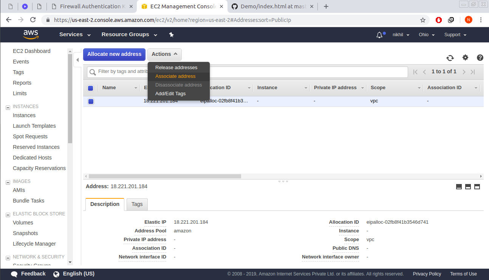

b) Choose resource type as Instance and enter your virtual server's Instance ID in the Instance field.Now, choose the
   private IP address of that instance. The private IP address of that instance is already there when you will click on
   Private IP address field.
   At last click Associate button to finish the process.

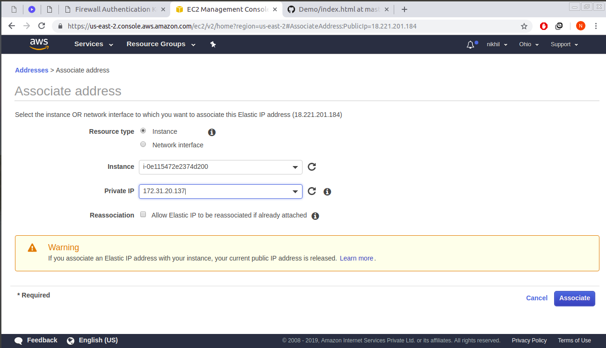

You will notice that now the Elastic IP address you have allocated has been associated to the instance.

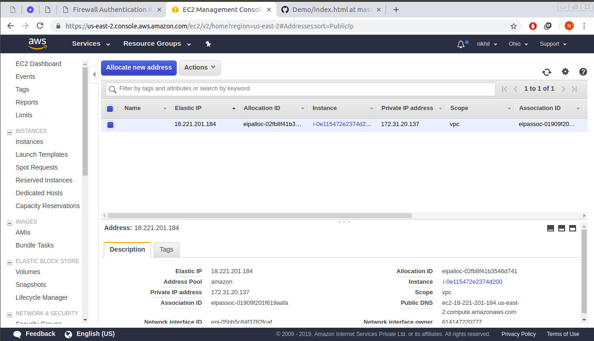

Now, we will connect multiple public IP address with a virtual server by using multiple network interfaces. This will be useful for us to host multiple different websites on the same virtual server.

<h2> 2. Adding an additional network interface to a virtual server and assigning it with a new public IP address </h2>

It is possible to add multiple network interfaces to a virtual server and control the private and public IP address associated with those network interfaces. We will use an additional networking interface to connect a second public IP address to our virtual server. 

Follow these steps to add an additional network interface to your virtual server.
a) Select Network Interfaces from submenu of EC2 Management Console. It will show you two network interfaces if its your new account. One is default network interface and other one is the network interface of your virtual server. 

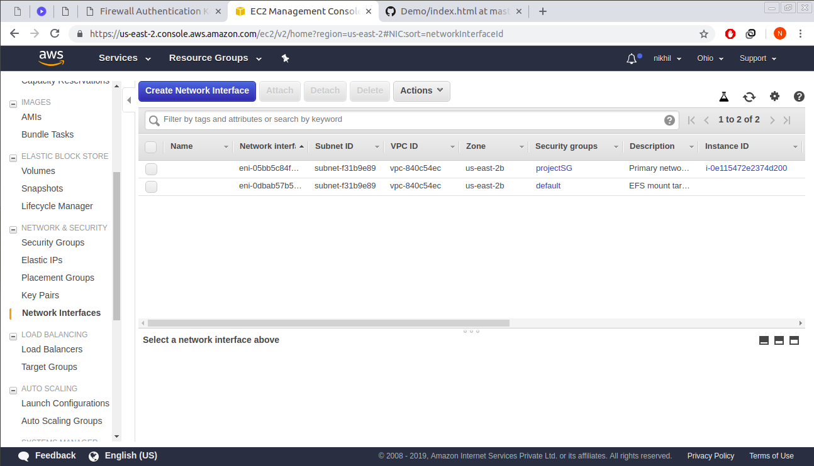

b) Click Create Network Interface. A dialog box opens.

c) Enter 2nd Interface as the description and choose your virtual server's subnet as the subnet for the new networking interface. You can look of your instance subnet in your server details by clicking Overview button.
Leave the Private IP address empty and select the security group that you have created above, for example I have created projectSG so I will choose that security group.

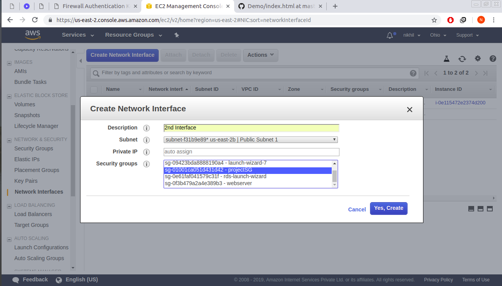

d) Click Yes, Create to create the new network interface with the configuration you have selected.

e)When the new network interface's state changes to available, you are ready to attach it with your virtual server. Selec
  the 2nd Interface and choose Attach under Actions menu.

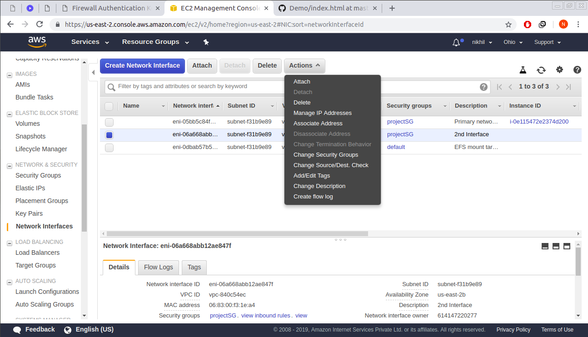

f) Choose the ID of your running virtual server and click Attach.

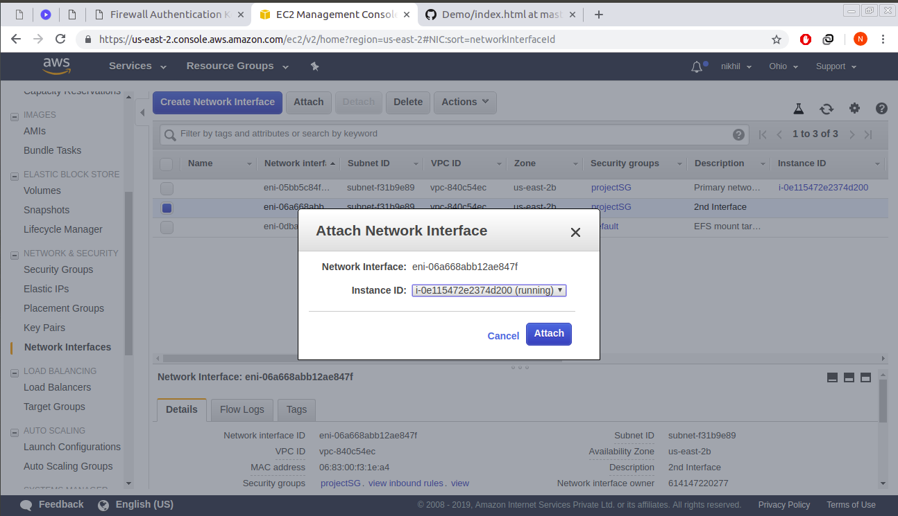

g) The new network interface have now been attached to your virtual server.Next, we will connect an additional public IP address to the additional interface. To do so, note the new network interface ID and again allocate a new Elastic IP address as you did in step 1.

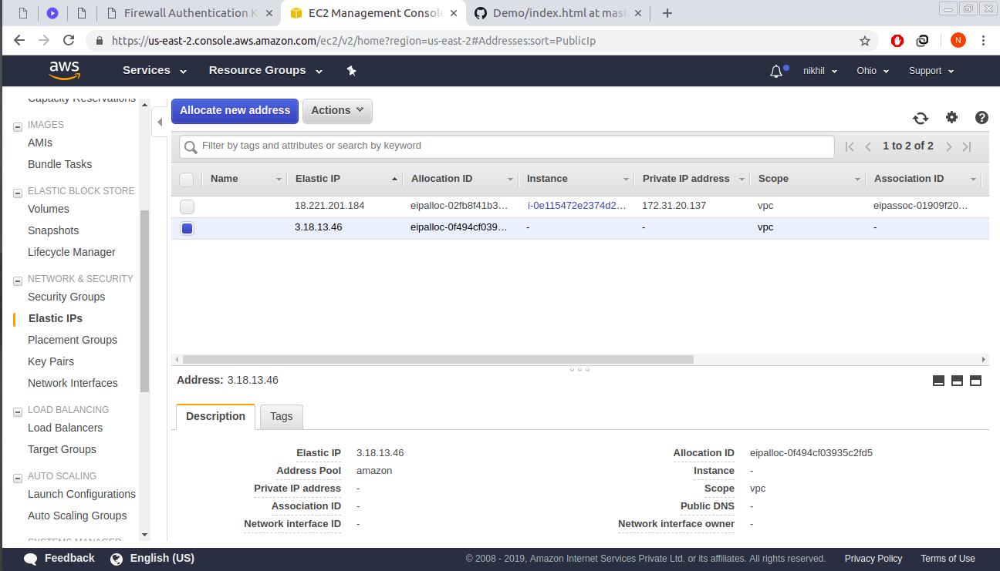

h) Choose the new public IP address and choose Associate Address from the Actions menu. Now instead of selecting Instance in resource type, select Network Instance. Choose the network interface ID that you have noted and the private IP address and click Associate.

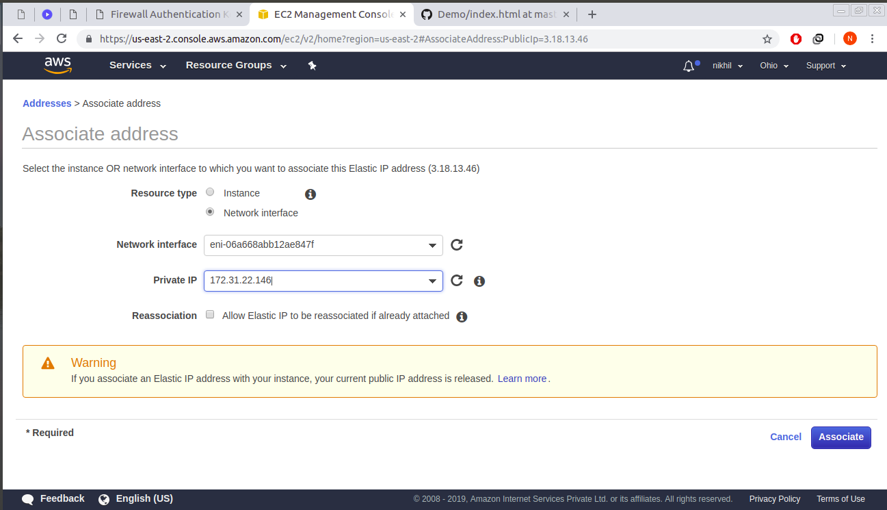

You can see that the new public Elastic IP address has now been associated to the new network interface of the instance.

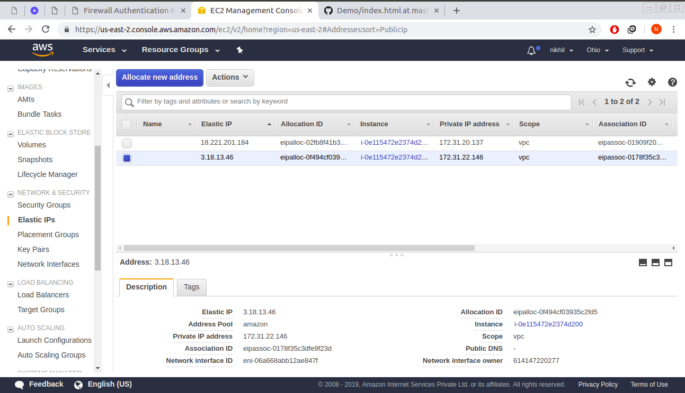

<b> Great!!! </b> Our virtual server is now reachable under two different public IP address. This enables you to serve two different websites, depending on the public IP address.
Now, we only need to configure our virtual server through SSH to answer request depending on the public IP address.

Connect your virtual server through SSH login and host multiple websites on your instance.

a) Remember the key you downloaded during your instance creation. Move to that directory where your key is present in your system. This step is done to change the permission of your downloaded key pair. When you are in that directory run:

```javascript
chmod 400 yourkeypairname
```
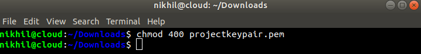

b) Now login to your instance using below command. The username for linux machine that we have created will be <b>ec2-user</b> but if you have created other machine refer [AWS Docs](https://docs.aws.amazon.com/AWSEC2/latest/UserGuide/AccessingInstancesLinux.html)

During connecting it will ask you <b> Are you sure to continue connecting (yes/no)? </b>, write yes.

```javascript
ssh -i yourkeypairname username@PublicDNS
```

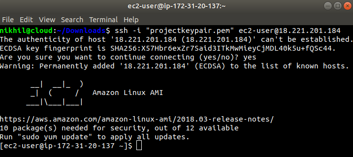

c) After SSH login first step is to install a default web server by executing
```javascript
sudo yum install httpd -y
```


To start the web server, execute the command
```javascipt
sudo service httpd start
```
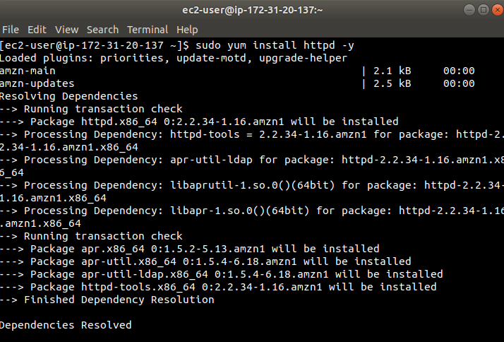

d) Execute the below command to work as root user.
```javascript
sudo -s
```
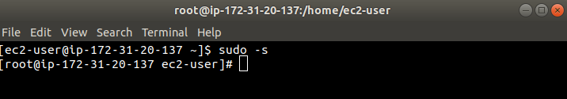

e) Create a directory where you will host your first website. Execute the below command. In this command instead of first_website you can choose any name for your directory.

```javascript
mkdir /var/www/html/first_website
```

Now, store your first website which you want to host in that directory. Either you can get a sample of website or you can create your own website using vim editor and saving it in that directory. Here I am using just cloning a sample of website from Internet.

```javascript
wget -P /var/www/html/first_website https://raw.githubusercontent.com/AWSinAction/code/master/chapter3/a/index.html
```
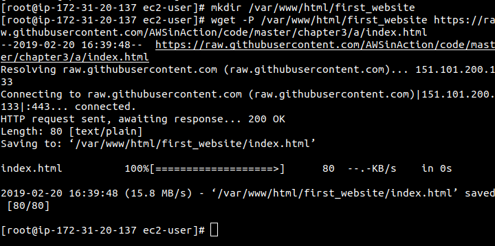

f) Repeat the step (e) to make a second directory named second_website and also create a second sample website. Execute the below commands:

To make a second directory:
```javascript
mkdir /var/www/html/second_website
```
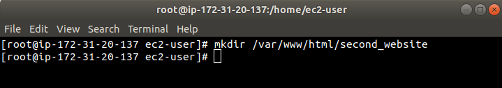

To store a second sample website:
```javascript
wget -P /var/www/html/first_website https://raw.githubusercontent.com/AWSinAction/code/master/chapter3/b/index.html
```
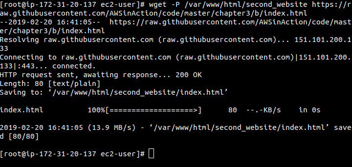

g) Next,you need to configure the web server to deliver the websites depending on the called IP address. To do so,add a file
named first_website.conf under <b> /etc/httpd/conf.d </b> with the following content.

```javascript
<VirtualHost 172.31.x.x:80>
   DocumentRoot /var/www/html/first_website
</VirtualHost>
```
Make sure to change the IP address from 172.31.x.x to the IP address from the ifconfig output for the networking interface eth0.

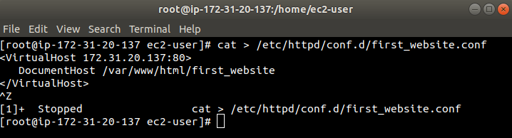

h) Repeat the same process for the second configuration file named second_website.conf under <b> /etc/httpd/conf.d </b> with the following content.


```javascript
<VirtualHost 172.31.y.y:80>
   DocumentRoot /var/www/html/second_website
</VirtualHost>
```
Make sure to change the IP address from 172.31.y.y to the IP address from the ifconfig output for the networking interface eth1.

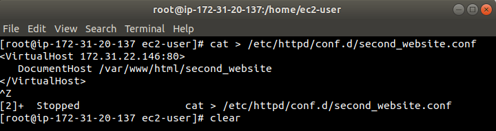

i) The last step is to activate the new web server configuration. To do so execute

```javascript
sudo service httpd restart
```
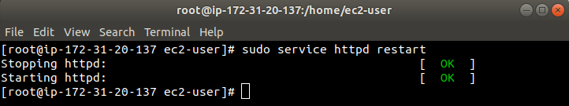

j) Change to the Elastic IP overview in the EC2 Management Console. Copy both the Elastic IP addressess and open them with your web browser. You will get the output of your html file you created or cloned in your directory depending on the public IP address you are calling.

Result of first website from first public IP address

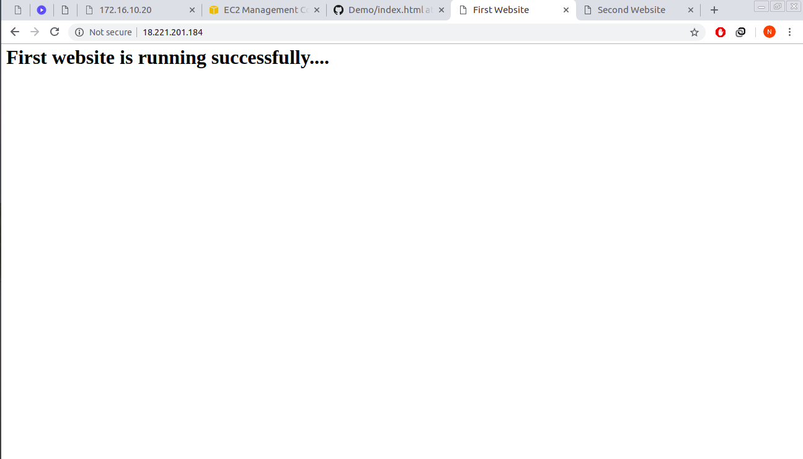

Result of second website from second public IP address.

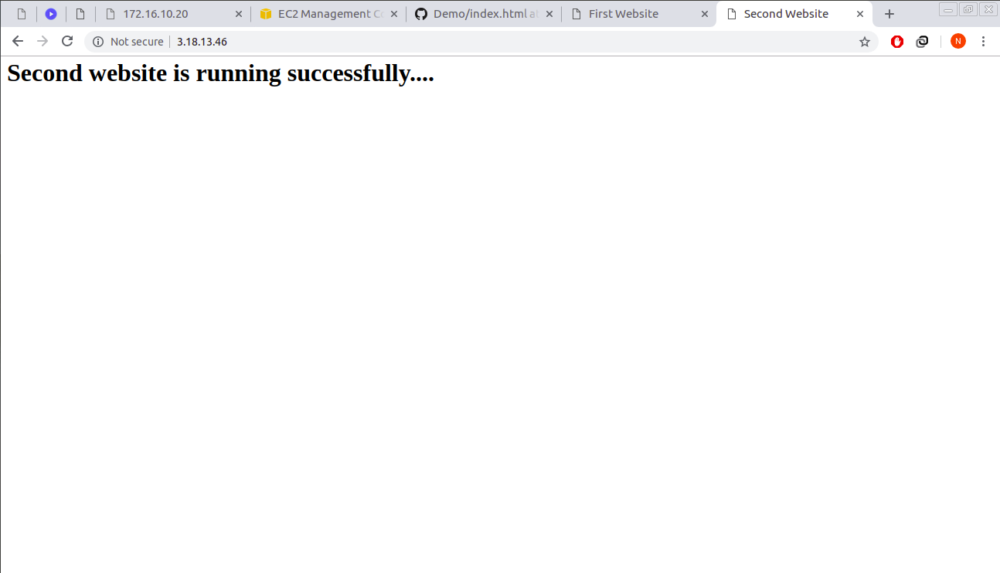

In this way you can deliver two different websites from the same virtual server.

