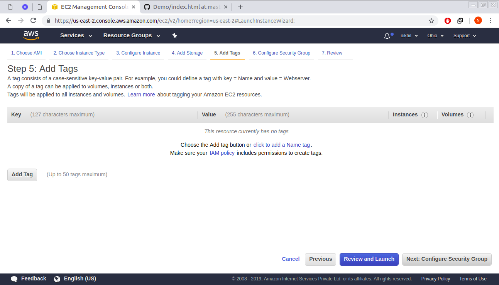

# Hosting mulitple static websites on a single server
This repository acts as a guide to host multiple websites on a single server using AWS (Amazon Web Services).

<h2> Attribution </h2>
Hello everyone, you are welcome to make use of this guide and learn from it but please do not copy without giving attribution to the author.

<h2> Let's Start the Guide </h2>

First of all we will learn how to launch a virtual server on AWS on which we will be hosting our static websites. It takes only a few clicks to launch a new virtual server.
1. Open the AWS Management Console at https://console.aws.amazon.com.

2. Choose the region in which you want to launch your virtual server and make sure you choose the region nearer to users to        reduce latency.

3. Find the EC2 service in the navigation bar under Services and click it. It will open the EC2 Management Console.

4. To start the wizard for launching a virtual server, start by clicking on Launch Instance button.

This is how your EC2 Management looks like.

After clicking on the Launch Instance button you will be redirected for selecting the operating system for your virtual machine. The first step is to choose a bundle of an OS and preinstalled software for your virtual server called an Amazon Machine Image(AMI). Here I will be working on Amazon Linux AMI 2018.03.0(HVM).

After selecting the AMI it's time to choose the size of your virtual server by choosing the Instance Type. The smallest and cheapest virtual server will be enough so select the instance type t2.micro which is also free tier eligible and then click Next:Configure Instance Details.

In the next step where you want to configure Instance Details, choose the VPC and the subnet in which you want to provision the instance(virtual server). Make sure you select public subnet and must also remember the availability zone of that subnet.
Also under <b>Auto-assign Public IP </b> choose <b>Enable</b> so that a public IP is provided.
You can also change other details for your virtual server but for now keep the defaults and click Next:Add Storage.

In the next step, there will be option to add storage to your virtual server. Leave the root storage as default and click Next:Tag Instance.

Another step is to provide tags to your virtual server. Tags help you to organize resources on AWS. A tag is nothing but a key-value pair. It is an optional step so skip it by clicking Next:Configure Security Group.

The next step is to configure the security group i.e. a firewall that helps to secure your virtual server. There are two options in this step. Either you can create a new security group or select an existing security group. If you do not have a security group click on create a new security group and make a new one by adding rules just as shown in below screenshot. After configuring the security group, click Review and Launch.

In the next step, the wizard shows a review of all the configurations you have made to your new virtual server. If everything seems fine, click the Launch button.

Last but not the least, the wizard asks for Select an existing key pair or create a new key pair. It depends on you. If you already have a key pair and it is with you then choose existing key pair, otherwise create a new key pair and download it.
After downloading click Launch Instances.

Your virtual server launches. Open an overview by clicking View Instances and wait until the server reaches to its running state and also make sure that it passes both status checks i.e. 2/2 checks.

